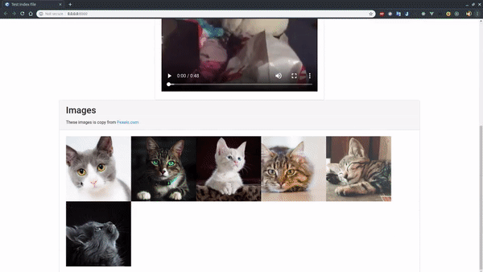

# LEARN BASICS PROJECT

## Simple Webserver

Learn to make a simple webserver with C++11 on Linux Socket Library

Enviroment: Linux

## Example Screenshots



## Things that it can handle

- [X] HTTP Request Headers (with some common headers)
- [X] HTTP Response
- [X] Basic Routing
- [ ] HTTP Body, Queries, ...
- [ ] HTTP/2
- [ ] UTF-8
- etc ... (haven't done)

## Build example

### Requirement

- CMake

```bash
cmake CMakeList.txt
make
```

## Run
```bash
cd ./web
./index
```

## Clean
```bash
make clean
```

Website is run on *http://localhost:8000*
